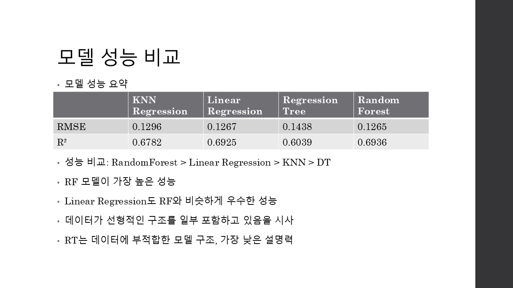
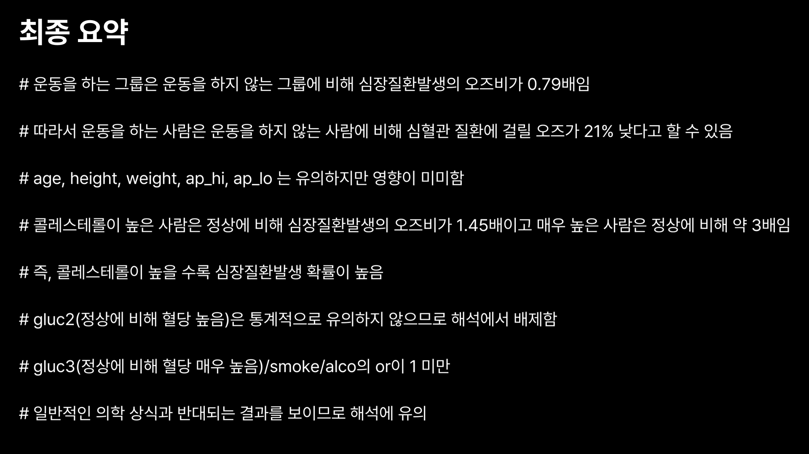

# 👋 안녕하세요, 데이터로 인사이트를 얻고 가치를 만드는 Data Scientist로 성장하고 있는 김이찬입니다.

 

## 🙋‍♂️ About Me
저는 통계 지식을 기반으로 R, Python을 활용하여 데이터의 숨겨진 패턴을 발견하고, 이를 명확하게 시각화하여 효과적인 커뮤니케이션을 통해 설득력 있는 인사이트를 도출하는 것에 강점이 있습니다.

최근에는 다양한 머신러닝 모델을 구축하고 성능을 객관적으로 비교/분석하여, 데이터 특성에 맞는 최적의 모델을 선정하고 그 근거를 제시하는 역량에 집중하고 있습니다.

저의 데이터 분석 경험과 문제 해결 역량을 통해 데이터 기반 의사결정을 돕고, 실질적인 성과를 창출할 수 있는 기회를 찾고 있습니다.

## 🎓 Education
- **학교:** 단국대학교
- **전공:** 정보통계학과
- **기간:** 2021.03 ~ (재학)

## 📜 Certification
- ADSP (한국데이터산업진흥원, 2024)
- SQLD (한국데이터산업진흥원, 2024)
- Linux master 2급 (한국정보통신진흥협회, 2024)
- 컴퓨터활용능력1급(대한상공회의소, 2025)
- TOEIC715(ETS, 2024)

## ✨ Core Competencies
- **데이터 분석 및 모델링:** Python(Pandas, Scikit-learn) 및 R을 활용하여 데이터 전처리, EDA, 머신러닝(회귀, 분류) 모델 구축 및 성능 평가
- **통계적 추론 및 분석:** 로지스틱 회귀, 가설 검정 등 통계 지식을 기반으로 데이터의 유의미성을 해석하고 비즈니스 인사이트 도출
- **데이터 시각화:** Seaborn, ggplot2 등의 시각화 라이브러리를 활용하여 분석 결과를 명확하게 전달하고 설득력 있는 리포트 작성

## 🛠️ Tech Stack

| 분야 | 기술 스택 |
| :--- | :--- |
| **Language** |    |
| **Data Analysis & ML** |        |
| **DevOps, Monitoring & Tools** |     |

 

## 🚀 Projects

### 1. 미국 지역 특성을 활용한 폭력 범죄율 예측 분석
- **[ 프로젝트 요약 ]**
    - 미국 내 지역 사회의 미국 연구조사의 사회경제적 데이터, 법 집행 데이터, 범죄 데이터를 활용하여, 폭력 범죄율 예측을 위한 4가지 주요 머신러닝 회귀 모델의 적합 및 성능 비교 분석.
- **[ 주요 역할 및 활동 ]**
    - EDA 및 데이터 전처리 수행
    - KNN Regression, Linear Regression, Regression Tree, Random Forest 모델 구현
    - 모델별 예측 성능을 RMSE, R-squared 지표로 비교 평가 및 최적 모델 선정
- **[ 핵심 성과 ]**
    - Random Forest 모델이 RMSE: 0.1265, R-squared: 0.6936으로 타 모델 대비 가장 우수한 예측 성능을 보임
    - 변수 중요도 분석을 통해 'pct1lleg(percentage of kids born to never married' 변수가 모든 모델에서 범죄율 예측에 가장 큰 영향을 미치는 것을 확인
- **[ 사용 기술 ]**
    - R, Rstudio
- **[ 시각화 결과 ]**
    -  
- **[ 🔗 Repository ]**
    - [[링크]](https://github.com/ANich479/US-Crime-Prediction)

---

### 2. 운동 여부가 심혈관 질환에 미치는 영향
- **[ 프로젝트 요약 ]**
    - Kaggle의 Cardiovascular Disease 데이터셋을 활용하여, 운동 여부가 심혈관 질환 발생에 미치는 영향을 통계적으로 분석 및 로지스틱 회귀 모델의 예측력 검토 및 변수들 간 상관관계 분석.
- **[ 주요 역할 및 활동 ]**
    - 데이터 전처리 및 공변량 분포 비교
    - 로지스틱 회귀 분석을 통한 운동 여부의 효과(Odds Ratio) 추정
    - 교호작용(Interaction effect) 검토 및 모델의 예측력(AUC) 평가
- **[ 핵심 성과 ]**
    - 운동을 하는 그룹이 그렇지 않은 그룹에 비해 심혈관 질환 발생의 오즈비가 O.79배임을 통계적으로 확인 (p<0.05)
    - 운동의 여부가 나이와 혈압, 콜레스테롤과의 교호작용이 있음을 확인
    - 교호작용을 포함한 모델과 포함하지 않은 모델 비교 결과 해석의 복잡도 대비 성능 향상이 크지 않았으므로 교호작용 미포함 모델을 최종 선택 (AUC: 0.7915)
- **[ 사용 기술 ]**
    - R, Rstudio
- **[ 시각화 결과 ]**
    -   
- **[ 🔗 Repository ]**
    - [[링크]](https://github.com/ANich479/cardio-exercise-analysis)

 

 ## 🌱 Learning Goals
- 현재의 머신러닝 모델링 역량을 시계열 분석(Time Series Analysis)과 딥러닝(Deep Learning) 분야로 확장하여, 더 복잡하고 다양한 형태의 데이터를 다룰 수 있는 역량을 확보하는 것을 목표로 하고 있습니다.
- 제가 가지고 있는 전공 지식을 강화하고 심화하여, 통계적 가설 검정 및 추론 능력을 바탕으로 비즈니스 문제 해결의 논리적 근거를 제시하는 전문가로 성장하고자 합니다.

## 📬 Contact
- 📧 **Email**: [juisaac7@gmail.com](mailto:your-email@gmail.com)
- 💻 **github**: [GitHub 프로필](https://github.com/ANich479)

  
 

## 📊 GitHub Stats
[![[ANich479]'s GitHub stats](https://github-readme-stats.vercel.app/api?username=ANich479&show_icons=true&theme=radical)](https://github.com/anuragroy/github-readme-stats)

